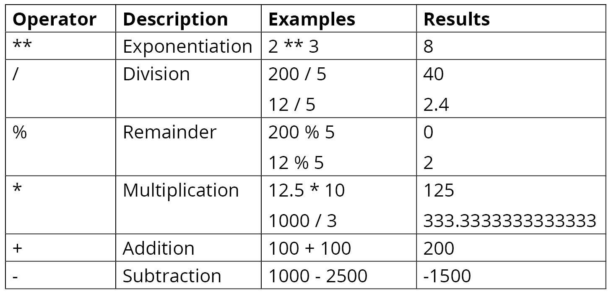
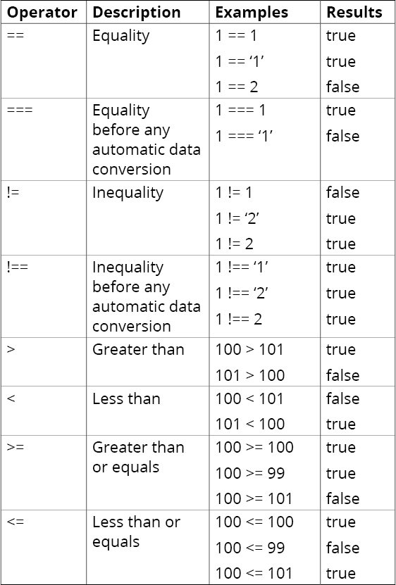
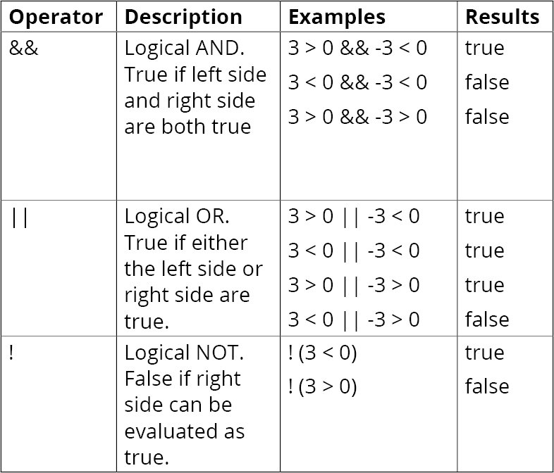
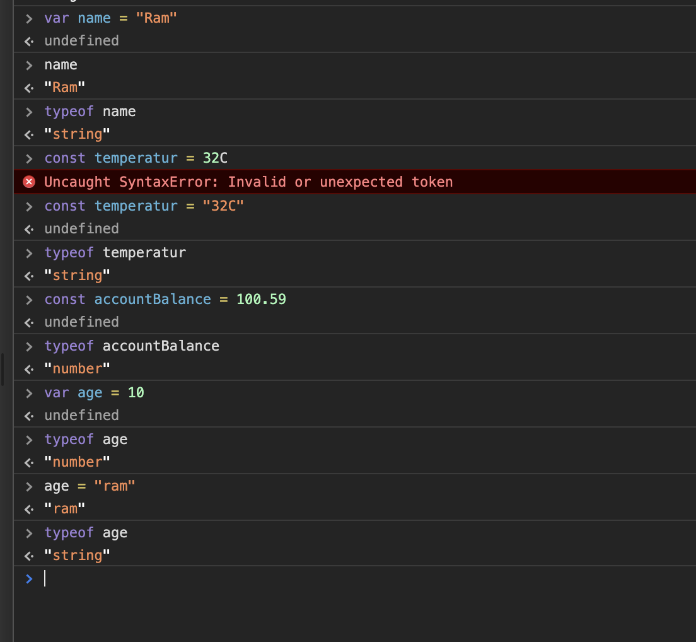

[](https://github.com/PacktWorkshops/The-JavaScript-Workshop/issues)
[](https://github.com/PacktWorkshops/The-JavaScript-Workshop/network)
[](https://github.com/PacktWorkshops/The-JavaScript-Workshop/stargazers)
[](https://github.com/PacktWorkshops/The-JavaScript-Workshop/pulls)

# The JavaScript Workshop

**All Content in this repository like text, images etc are copied and belongs to packtpub**
You already know you want to learn JavaScript, and a smarter way to learn JavaScript is to learn by doing. The JavaScript Workshop focuses on building up your practical skills so that you can develop cutting-edge applications for web, mobile and desktop users. Alongside knowledge of HTML and CSS, JavaScript is a key skill for those looking to enter professional web development. You'll learn from real examples that lead to real results. 

Throughout The JavaScript Workshop, you'll take an engaging step-by-step approach to understanding JavaScript code. You won't have to sit through any unnecessary theory. If you're short on time you can jump into a single exercise each day or spend an entire weekend learning about functional programming and unit testing. It's your choice. Learning on your terms, you'll build up and reinforce key skills in a way that feels rewarding. 

Every physical copy of The JavaScript Workshop unlocks access to the interactive edition. With videos detailing all exercises and activities, you'll always have a guided solution. You can also benchmark yourself against assessments, track progress, and receive content updates. You'll even earn a secure credential that you can share and verify online upon completion. It's a premium learning experience that's included with your printed copy. To redeem, follow the instructions located at the start of your JavaScript book. 

Fast-paced and direct, The JavaScript Workshop is the ideal companion for JavaScript beginners. You'll build and iterate on your JavaScript coding skills like a real software developer, learning along the way. This process means that you'll find that your new skills stick, embedded as best practice. A solid foundation for the years ahead. 

## What you will learn
* Learn how you can work with JavaScript to develop for the modern web
* Discover ways to write clean and maintainable JavaScript code
* Learn how to use unit testing to write bug free and stable JavaScript code
* Simplify your workflow with package managers like Gulp, Grunt, and Webpack
* Improve the performance of your web applications with server-side JavaScript
* Explore ways to access and process external resources within your JavaScript application 

**The examples of this title has been implemented in the Windows/MAC/Linux operating system.**

### Software Requirement
* IDE: Visual Studio Code Editor


**JavaScript Environments**
So far in our journey, we've only been exposed to the modern web browser as a JavaScript runtime, but even within browsers, there are a variety of JavaScript engines that serve as different runtimes for JavaScript. For instance, Chrome has the V8 engine, while Firefox runs JavaScript through SpiderMonkey. Just about every browser has its own distinct engine.

**There are also other runtimes aside from those that are browser-based. We'll have a look at the variety of runtimes available to us now.**

**1. Browser-Based JavaScript**
By far, the most common environment for using JavaScript throughout its entire history as a language is within the web browser.

**2. Server-Based JavaScript**
With the improvement in the performance of JavaScript engines in the web browser, people began wondering whether there may be other applications for the language and specific runtimes—particularly in terms of a server-based environment. In 2009, this became a reality with the creation of Node.js. A year before this, Google had open-sourced its powerful V8 JavaScript engine. This allowed developers to implement V8, along with specific operating system bindings, to produce the first version of Node.js

**3. Desktop JavaScript**
While not exactly a new environment for JavaScript to run with, desktop applications are a segment that ripe for growth as additional runtimes and libraries mature. The most popular solution for building desktop applications is Electron. Like similar frameworks, when developing applications for Electron, you will be using native web technologies that end up being wrapped in a native-focused container for any target desktop operating system.

**Electron apps can target Apple macOS, Microsoft Windows, or Linux, and are all built-in JavaScript**

**Elements view.**
 This view is super useful as it presents all the elements of a web document and the associated content and attributes in a very structured way. You will also notice that the various styles and event listeners will be available for you to explore within this view

**The Console View**
This is the developer tools view that we've had the most interaction with thus far and is likely to be the most important view when writing and testing JavaScript code. Using a JavaScript method such as console.log() will display output of all sorts of useful data for you to explore within the Console view, and you can even customize exactly the sort of data that is shown through various options associated with the view itself

**The Sources View**
When it comes to any sort of programming, the ability to set breakpoints to effectively pause code execution and debug your program at a certain state is critical. Using the source view, we can do this effectively, right within the web browser itself.
**Looks like only JS Code can be breakpointed.

**The Network View**
The final developer tools view that we'll look at before moving on is the Network view. This allows you to keep tabs on everything being transferred as part of your application. HTML documents, JavaScript files, CSS files, and even invisible content such as XMLHttpRequests (XHR) and other behind the scenes data transmissions are all logged and measured here for you to inspect.
***One of the important aspects of the Network view that you'll want to note is that Disable cache is a tool option. Disabling the browser cache is an especially good idea if you are making many changes to externally loaded .js files while testing your program as it will prevent these files from being cached by the browser while testing.***


**HTML Element Manipulation with JavaScript**
```
<body>
    <script>console.log('Before h1 tag')</script>
    <h1>JavaScript Execution Order</h1>
    <script>console.log('After h1 tag')</script>
    <p id="para_id">View the browser console to see the effective order of execution.</p>
    <script>document.getElementById('para_id').innerText = "Paragraph Content Changed"</script>
</body>
```

**Operators**



When we compare a number with a string with the same numeric value using the == operator, data type conversion takes place. This is shown in the following snippet:
```
> 100 == "100"
\\Output. Data type conversion takes place
< true
```



**Not all operators are symbols.**
A very helpful operator is typeof. It shows the data type as a string. The operator is all lowercase letters. Use the group operator to get the type of an expression using other operators.

For example, the typeof operator controls the precedence of expression evaluation:

```
typeof 100
TypeOf 100
typeof "100"
typeof true
typeof (1 > 2)
typeof (2 + " dozen eggs")
```
The output for each of the preceding examples would be as follows:

```
number
Uncaught SyntaxError: …
string
boolean
boolean
string
```

Example:
```
> 100 - 10 + " Main Street"
\\Output. 
< "90 Main Street" 
When string is in expression JavaScript attempts to convert all other elements to a string.
```


**Variables:**

For variables, there are two declaration keywords: var and let. For constants, the declaration keyword is const.

```
var errorMessage
var isSold
```
Variables that are not assigned a value still have a data type. That data type is named **undefined**. The typeof operator detects undefined data types.



### Framework versus Library

Library describes an external collection of functions that perform a given task. These functions are made accessible to us as users of the library via APIs. One useful library is lodash, which can, for example, remove all duplicated values from an array:
```
const duplicatedArray = [1,2,1,2,3];
const uniqueArray = lodash.uniq(duplicatedArray)
// => [1,2,3]
```
Frameworks, on the other hand, are a particular form of library. They are reusable code frames that build the foundation of a JavaScript application. In contrast to libraries, which extend your code with functionality,

Despite the technical differences between libraries and frameworks, we are going to use those terms interchangeably. Another synonym you'll encounter in the JavaScript world to describe external source code is "package." 

*We have just looked at lodash.js, a library that helps developers handle data structures; (to be used, for example, making arrays unique) and Vue.js, a framework for building modular and dynamic user interfaces. These are just two examples of quite popular and widely used JS frameworks/libraries. In addition to those, there is a vast and ever-growing number of external packages you can choose from. Each one of them is useful for solving one specialized set of problems.*

**A few modern and often used alternatives that support creating browser applications are, for instance, React.js, Vue.js, and Angular.js. Other libraries that help you store and manage data in your app are MobX, VueX, and Redux.**

Again, others can transform source code so that it **supports older browser engines, for example, Babel, or handle and manipulate time for you, such as moment.js.**

Then, there are frameworks such as **Express.js or Hapi that let you create simple, easy‑to-maintain, and performant REST APIs for Node.js.**

Some packages make building command-line interfaces (CLIs) or desktop applications easy.

Most build and productivity tools for the JavaScript ecosystem are provided to the community as a library, too. Webpack, Parcel, and Gulp are a few of these tools.

Not all of the available libraries are equally popular or useful. Their popularity depends on a few key facts:

*Whether they fix a problem that bothers many developers
*How well their API is defined and structured
*The quality of their documentation
*The level of performance optimization

### Everlasting jQuery
One evergreen library that has been around for over a decade is jQuery. It touches almost every web app in one way or another and belongs in the toolkit of everybody who builds browser applications.

jQuery provides, but is not limited to providing, the following features:
*DOM manipulations
*Event handling
*Animated effects and transitions

## Where to Find and How to Use External Code
There are a few different approaches when it comes to including libraries in your program. Depending on those approaches, we get packages from different places.

One is to copy the library's source code and to handle it as we wish. This approach is the most secure in the sense that we have all the control of the software and can customize it to fit our needs. However, by doing so, we give up compatibility and automated updates and patches. Most open-source projects host their code on GitHub or any other version control platform. Therefore, it's rather easy to access and fork the package's code. As soon as we download the source code, we can do whatever we want to get it working with our software. Possible solutions could be hosting it on our **cloud distribution network (CDN)** and accessing it from there or bundling it with our source code.

Another approach is downloading the package from a CDN from the client at runtime. The most popular CDN to exclusively host JavaScript libraries is available here. It hosts thousands of libraries you can include in your markup without you having to worry about where to store it or how to upgrade it.

**Looks like cdn is similar to mavenCentral ot jetpack() that is used in gradle file.**

The following is an example of how you'd include Vue.js with your markup:

```
// myApplicationMarkup.html
<html>
<script src="https://cdn.jsdelivr.net/npm/vue/dist/vue.js"></script>
<script type="text/javascript">
console.log("Vue was loaded: ", !!Vue)
// => Vue was loaded: true
</script>
</html>
```
```
Note: If you include packages by loading them from the browser during runtime, you have to be aware of the order of the script tags. They're loaded from top to bottom. Therefore, if you switched the two script tags in the preceding example, console.log would print that there is no Vue.js loaded, even though, eventually, it will be.
```